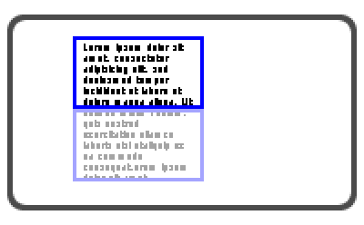
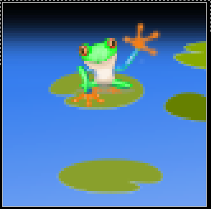

# harness

Harness is a Lua toolkit to help scaffold your LÖVE user experience.

Harness uses [Kikito's tween library](https://github.com/kikito/tween.lua).

### running the examples

Symlink (or copy) harness into the examples directory.

    ln -s $(pwd) examples/

Then symlink the example you want as `main.lua`

    ln -s full-example.lua main.lua

Now you can run it

    love .

# API documentation

See [Documentation](doc/index.html)

# digit roller

The digit roller simply watches a value on a table for changes, this value must be a number value. The roller then interpolates the displayed value via a tween, so it appears to count up or down.

[Documentation](doc/modules/digitroller.html)

Here is a [list of easing functions](https://github.com/kikito/tween.lua#easing-functions) available.

# aperture

The aperture provides a constrained view of a larger drawing. Like the photographer who touches the tips of her thumbs together, framing a shot.

_figure 1 shows some text drawn to the screen. The top frame indicates the aperture position and size, anything drawn in this area is visible._

[Documentation](doc/modules/aperture.html)

# hotspot

The hotspot is a simple yet magical thing. Use it to track clicking on areas easier.

[Documentation](doc/modules/hotspot.html)

# camera

Provides a camera to limit drawing to arbitrary positions. It allows drawing scrollable surfaces inside a frame, the motion of moving the camera is fluid, and it can look at any arbitrary point inside it's view. It also provides a function to center the camera on any point.

[Documentation](doc/modules/camera.html)

# buttons

Provides a clickable button similar to a hotspot, with the exception you don't specify the size, which is automatically measured from the button text. It provides high flexibility as demonstrated in the examples by creating a two-state switch component.

[Documentation](doc/modules/button.html)

Also see [widget collection documentation](doc/modules/widgetcollection.html)

# trig

Provides some trigonometry functions.

[Documentation](doc/modules/trig.html)

# document generation

LDoc is used to generate documentation for the source code, it is included as a git submodule. It requires the penlight rock.

    # pull the LDoc submodule
    git submodule init && git submodule update

    # install penlight dependency
    luarocks install penlight

Run generation:

    lua LDoc/ldoc.lua .

Find the documentation under `doc/`.

# license

  This program is free software: you can redistribute it and/or modify
  it under the terms of the GNU General Public License as published by
  the Free Software Foundation, either version 3 of the License, or
  any later version.

  This program is distributed in the hope that it will be useful,
  but WITHOUT ANY WARRANTY; without even the implied warranty of
  MERCHANTABILITY or FITNESS FOR A PARTICULAR PURPOSE.  See the
  GNU General Public License for more details.

  You should have received a copy of the GNU General Public License
  along with this program. If not, see http://www.gnu.org/licenses/.
